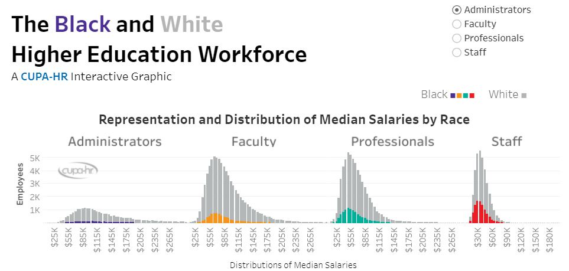

This interactive graphic explores the representation and pay of Black employees across the higher education workforce. <a href="https://www.cupahr.org/knowledge-center/diversity-resources/black-and-white-higher-education-workforce/" target="_blank"/>Click here to visit.

</a>
