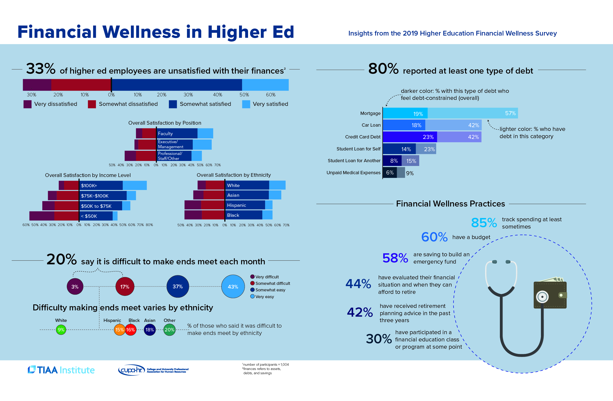

This infographic summarizes key takeaways from a TIAA Institute/CUPA-HR survey on financial wellness in Higher Education. It was printed as a 2-page spread in CUPA-HR's *Higher Ed HR Magazine,* Winter 2019-20, distributed to over 30,000 members.

