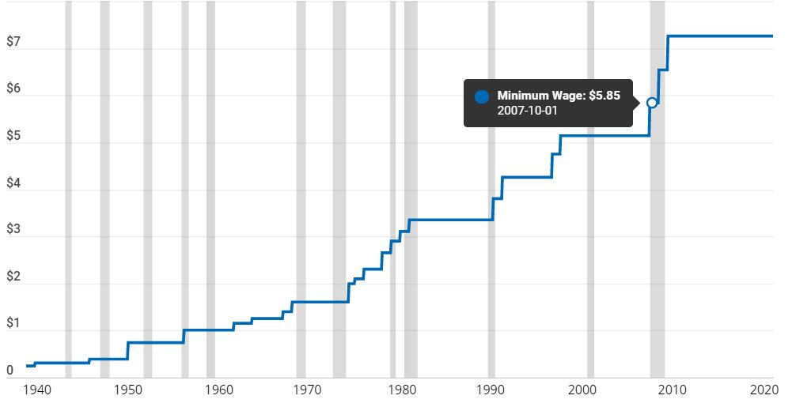
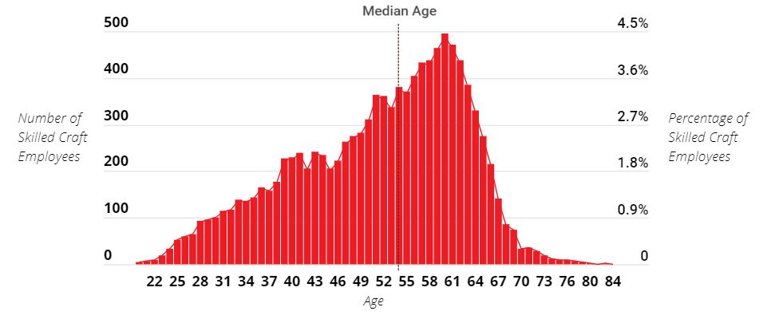
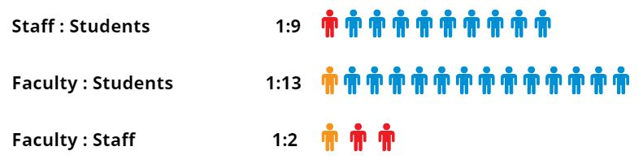

<a href="https://www.cupahr.org/surveys/research-briefs/minimum-wage-changes-higher-ed/" target="_blank">

## How Will Minimum Wage Changes Impact Higher Ed?

</a>

----

<a href="https://www.cupahr.org/surveys/research-briefs/2021-higher-ed-skilled-craft-workforce/" target="_blank">

## The Higher Ed Skilled Craft Workforce: Pay, Aging, Diversity, and Equity

</a>

----

<a href="https://www.cupahr.org/surveys/dataondemand/hr-benchmarking/" target="_blank">

## 2021 HR Benchmarking Stats

</a>