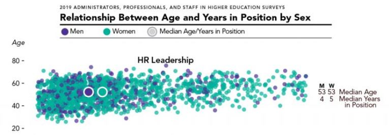
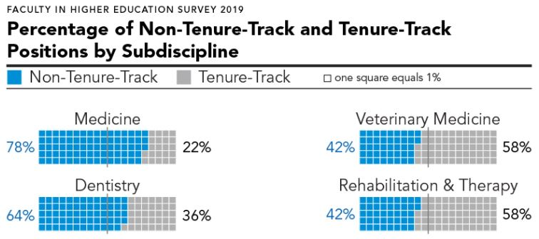

<a href="https://www.cupahr.org/surveys/research-briefs/2020-the-higher-ed-hr-workforce/" target="_blank">

## The Higher Ed HR Workforce

</a>

----

<a href="https://www.cupahr.org/surveys/research-briefs/faculty-in-the-health-professions/" target="_blank">

## Faculty in the Health Professions: Growth, Composition, and Salaries

</a>

----

<a href="https://www.cupahr.org/blog/a-comprehensive-look-into-the-wellbeing-of-higher-ed-employees/" target="_blank">

## A Comprehensive Look Into the Well-Being of Higher Ed Employees

</a>