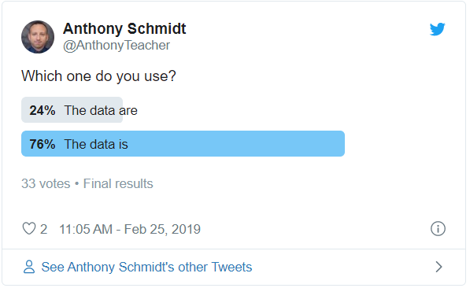

*This blog post was originally published on my other blog, [AnthonyTeacher.com](http://www.anthonyteacher.com/blog/the-data-areis-in)*

Recently, it has come to my attention that I use data as a singular noun, as in “The data is nominal” rather than the plural Latinate form that it technically is, as in “The data are nominal.” To those who brought it to my attention, it is a simple mistake. Fix it. Move on.

But, hold up. I’m not so sure about that. I do not like my natural language use corrected. I will use singular they in writing. I will use so as an adverbial connector while speaking. And, dammit, I will use data in the singular.

Is this just my youthful rebellious spirit? Am I on the vanguard of language change? Am I right? Are they wrong? The answer, as you can guess is yes and no. Both “data is” and “data are” seem acceptable. Here’s the evidence:

**1. Twitter**

I first turned to Twitter with a poll.

Validation! But, I wanted a more reliable data source, so I began looking at more scientific linguistics tools.

**2. Google N-Gram Viewer**

The Google N-Gram viewer (see graph below) tells me that, although “data are” is more common, “data is” is also common and has been rapidly increasing in usage in books since the late 1940s. Interestingly, “data are” skyrocketed the 1970s and peaked in the early 1980s (when I was born) and has been in free fall since then. “Data is” hit a small peak around 2000, when I was in college and probably was exposed to more data-based ideas. Similar to “data are,” “data is” has been in decline (I have no guess as to why) and now they are both similar in frequency.

The conclusion here is that, although “data are” once reigned supreme and “data is” has climbed slowly in popularity, they have been able to literally meet each other in the middle.

**3. Corpus of Contemporary American English (COCA)**

A general search of [COCA](https://corpus.byu.edu/coca/) tells me the following:

<table>
<tbody>
<tr>
<td><strong>FORM</strong></td>
<td><strong>FREQUENCY</strong></td>
<td><strong>EXAMPLE</strong></td>
</tr>
<tr>
<td>data were</td>
<td>4830</td>
<td><em>Unfortunately, they did not analyze the impact of fees, as all <b>data</b> <b>were</b> net of fees&#8230;</em></td>
</tr>
<tr>
<td>data are</td>
<td>3088</td>
<td>These <b>data</b> <b>are</b> sensitive and consumers have a right to decide whether or not they can be&#8230;</td>
</tr>
<tr>
<td>data is</td>
<td>2069</td>
<td>&#8230;but the resulting <b>data</b> <b>is</b> complex and messy.</td>
</tr>
<tr>
<td>data was</td>
<td>1075</td>
<td>Most of the <b>data</b> <b>was</b> culled from studies conducted from the mid-1990s forward at sites in Illinois, Indiana&#8230;</td>
</tr>
</tbody>
</table>

One thing the prompted me to do this research was the use of “data is/are” in academic contexts, so a little more searching in COCA revealed the following:

  1. “Data is” is 3.8 times more common in academic texts than other genres
  2. “Data are” is is 16.8 times more common in academic texts.
  3. “Data were” is 88.9 times more common in academic texts. In fact, this phrase was quite rare in other genres.
  4. “Data was” is 10.8 times more common.
  
The conclusion from COCA is similar to the conclusion from Google’s N-Gram viewer: “data are” is more common, especially in academic texts, but “data is” is also common, even in academic texts.
  
  
**4. Other Corpora**

Have you visited the [BYU corpus page](https://corpus.byu.edu/) lately? A few years ago, it was dominated by COCA and the [BNC](https://corpus.byu.edu/bnc/), but it has grown quite a bit since then and we have our choice of corpora ranging from [News on the Web](https://corpus.byu.edu/now/), [Wikipedia](https://corpus.byu.edu/wiki/), and even [TV](https://corpus.byu.edu/tv/) and [Movie](https://corpus.byu.edu/movies/) corpora. I chose three to do a quick comparison of “data are/is”.

<table>
<tbody>
<tr>
<td><strong>Source</strong></td>
<td><strong>&#8220;data are/were&#8221; Frequency</strong></td>
<td><strong>&#8220;data is/was&#8221; Frequency</strong></td>
</tr>
<tr>
<td><a href="https://corpus.byu.edu/glowbe/">GloWbe</a></td>
<td>32 / 24</td>
<td>654 / 206</td>
</tr>
<tr>
<td><a href="https://corpus.byu.edu/tv/">TV Corpus</a></td>
<td>16 / 12</td>
<td>327 / 103</td>
</tr>
<tr>
<td><a href="https://corpus.byu.edu/now/">News on the Web</a></td>
<td>11,728 / 4,594</td>
<td>83,123 /18,782</td>
</tr>
</tbody>
</table>

What this data suggests is that “data is” may have grown in tandem with growth in the media, especially online media. This is evident from the higher frequency in the more informal corpora above and the peaks around the year 2000. This growth likely bled over into academic usage as more people were exposed to or participated in these newer forms of communication. However, it is important to recall that the evidence shows “data” as a singular noun existed prior to that growth, too. The growth in media likely amplified the movement of “data is” into common usage.

**5. Latinate Cousins**

“Data” is not the only plural word used as singular: agenda, bacteria, criteria, media. These are all technically plural forms but often used in the singular. Here is how they are used (from COCA): 

<table>
<tbody>
<tr>
<td><strong>Term</strong></td>
<td><strong>&#8220;are / were&#8221; frequency</strong></td>
<td><strong>&#8220;is / was&#8221; frequency</strong></td>
</tr>
<tr>
<td><strong>Agenda</strong></td>
<td>61 / 34</td>
<td>736 / 258</td>
</tr>
<tr>
<td><strong>Bacteria</strong></td>
<td>338 / 156</td>
<td>108 / 37</td>
</tr>
<tr>
<td><strong>Criteria</strong></td>
<td>448 / 457</td>
<td>119 / 80</td>
</tr>
<tr>
<td><strong>Media</strong></td>
<td>1060 / 376</td>
<td>1655 / 463</td>
</tr>
</tbody>
</table>

And here is their growth from Google N-Gram Viewer:

**6. Is it a British thing?**

I love British English and its quirky grammar and vocabulary, like “government are” rather than the American “government is”. So maybe the “data are/is” thing is a holdover from British English since they do prefer plural forms. Interestingly, looking at the British National Corpus, “data are” and “data is” are almost equally as frequent (491 vs 452, respectively). Looking at just the US and GB dialect forms in the GloWbe Corpus reinforced this. In fact, “data is” was more common than “data are” for all inner-circle and outer-circle English varieties:

**7. PLOS One**

For my last check, I used [AntCorGen](https://www.laurenceanthony.net/software/antcorgen/) to generate a corpus of 300 results sections from various peer-reviewed journals that are part of PLOS One and then ran a frequency search for “data are” and “data is”. The results were unsurprising: 72 for “data are” and 69 for “data is”. While “data are” had higher frequency in total, “data is” had greater range (greater representation in more than 1 text rather than frequent use in single text): 40 vs 30.

**8. Cognitive Linguistics**

Thus far, I have explained “data” in the singular sense as a side effect of media growth. However, I think this is neither a fully accurate nor fully plausible explanation. So, what is another way it can be explained? One way is through a cognitive linguistic understanding of “data”. In other words, how is “data” represented in the mind? Is “data” conceived of as numerous individual numbers or as a singular set of numbers? Is “data” the part or the whole? I’d argue that, since humans tend towards gestalt grouping, when we speak of data, we are not speaking of figures or numbers or even datums. We are, instead, referring to a singular group  or body of information. This mental representation then, when reflected in our lexicogrammar, takes the singular form: “the set is,” “the information is”.

**Limitations**

I searched mainly for present and some past tense forms of the be verb. I did not, however, check agreement with other common collocating verbs such as show, indicate, suggest, etc.

**Conclusion**

My exploration through the data has confirmed my original hunch: both forms are acceptable and “data is” has been growing in popularity, growth which has been concomitant with the growth of the media. Furthermore, as data has become more important in our society, it has naturally taken on a singular cognitive gestalt representation.

What does this mean for my own writing? I will continue to use the singular form of data and will proudly point any naysayers to its evidence because the data is in and it clearly shows “data is” is OK!

 