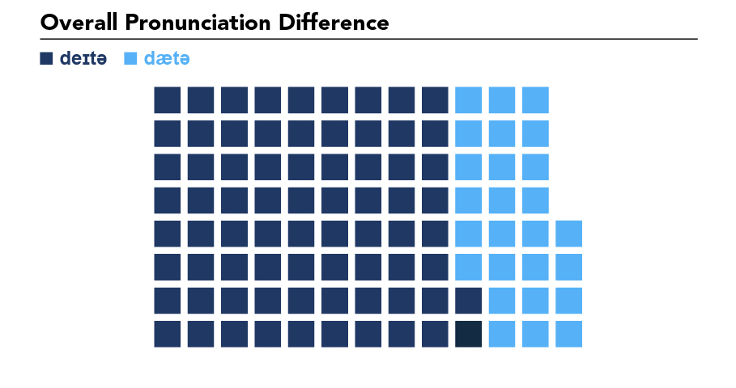
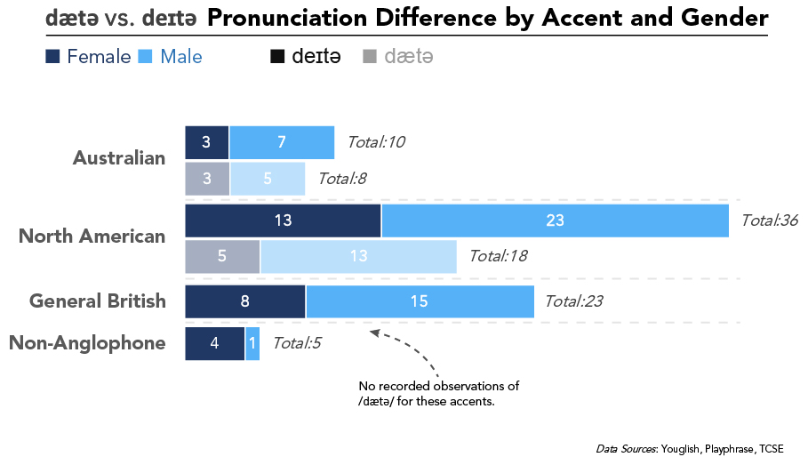

**Read this aloud: “We need more data.”**

How did you pronounce the word “data”? Was the “da” in data pronounced like day or was the “a” in “da” pronounced with the same “a” as in apple? In other words, do you say day-tuh (IPA: /deɪtə/) or dah-tuh (IPA: /dætə/; like the “a” in “apple”)?

Two things got me thinking about this. First, there was a brief [article](https://boingboing.net/2019/08/14/brent-spiner-explains-how-patr.html) and [video](https://www.youtube.com/watch?v=xeqTMTOxid8) that popped up on Twitter arguing that the creation of the character “Data” from Star Trek shifted the pronunciation of the word from /dætə/ to /deɪtə/. I’m not sure I believe this, but it did make me wonder when and why the schism or shift occurred.

Second, my new role as data visualization researcher had me thinking about how exactly I pronounce my title. Unconsciously, I default to /dætə/. However, when I begin to think about the word and say examples aloud, it seems my pronunciation vacillates between the two.

While I have no doubt that both pronunciations are “correct” and common, I did wonder which one was more common. I formulated several hypotheses and then developed a method to attempt to test them. I don’t claim that any of this is scientific, but it was really fun!

**HYPOTHESES**

  1. Given that I straddle the line between Gen Xer and Millennial, it is likely my pronunciation of data as /dætə/ is more common. This is just the phenomenon that occurs with my and the next generation. Therefore, younger people will be more likely to say /dætə/.
  2. /dætə/ or perhaps /da:tə/ will be more common in British English than /deɪtə/, which will be more common in American English.
  
**METHOD**

I had to devise a way to quickly listen to “data” in context across a variety of accents, genders, and ages. I decided to use three sources: Youglish, PlayPhrase, and the TED Corpus of Spoken English (TCSE).

  * [Youglish](https://youglish.com/search/data/all?) allows you to search YouTube for a word or phrase and then listen to the phrase in context from many different videos, including online lectures, webinars, TED Talks, etc. What’s more, it allows you to filter the videos by accent: US, UK, or Australian.
  * [PlayPhrase](http://playphrase.me/#/search?q=data) is similar to Youglish. However, rather than utilize YouTube, PlayPhrase mines popular TV shows (e.g. *Supernatural*) and movies (e.g. *Star Trek*)
  * [TCSE](https://yohasebe.com/tcse/) is also similar to the websites above. It utilizes only TED Talks (which also appear on Youglish).
  
I first used Youglish, listening to around 20 examples of “data” in US, UK, and Australian English. I then listened to about 20 clips each from PlayPhrase and TCSE (being careful not to repeat TED Talks). In total, I had 100 observations of “data” in context. As I listened, I coded the pronunciation as 1 = /deɪtə/ and 2 = /dætə/; M for male and F for female; US, UK, AUS, or L2 for the accent; and <40 or >40 for a general (and very unscientific) guess about the age of the speaker.

In regards to accents, while I recognize there is great variation among the accent categories, the accent codes are generalizations. A US accent represents anyone with a general North American accent. A UK accent represents any of the varieties of British pronunciation. AUS was used only for Youglish videos marked as Australian. Finally, L2 was used for speakers who were not from Anglophone countries (US, UK, IR, AU, NZ) and whose first language was likely not English (based solely on accent).

**FINDINGS**

My findings were surprising.

In regards to **hypothesis 1**, that /dætə/ is more common, I was completely wrong (see Figure 1) . Across all accents, genders, and ages, /deɪtə/ is actually more common. This really surprised me. Even among those older than 40, including the elderly, /deɪtə/ was used common.

In regards to **hypothesis 2**, I was even more wrong (see Figure 2). Those with British accents used /deɪtə/ rather than the other varieties. The only two accents where I heard /dætə/ was the US / North American accent and the Australian accent. For the US / North American accent, /dætə/ was used only 33% of the time; in other words, /deɪtə/ is more common.

While underrepresented in the sample (18 videos), it is important to note that /dæ tə/ seems most common in the Australian accent (44%). This is very surprising to me because of the close relationship between British and Australian English.

**LIMITATIONS**

Clearly, this is not a scientific study. The sample is small, does not represent accents equally, and is sampled online from online videos. However, it does give a general idea of what is the more common pronunciation.

**CONCLUSION**

In the end, this was a fun exercise. I learned that my speech pattern of “data” as /dætə/ is not in line with other aspects of my speech that are more common: singular they, singular data, so, like, etc.

Although I have a better idea of which pronunciation is more common, I still have no idea about the history of the word, when the shift occurred, and what facilitated it.