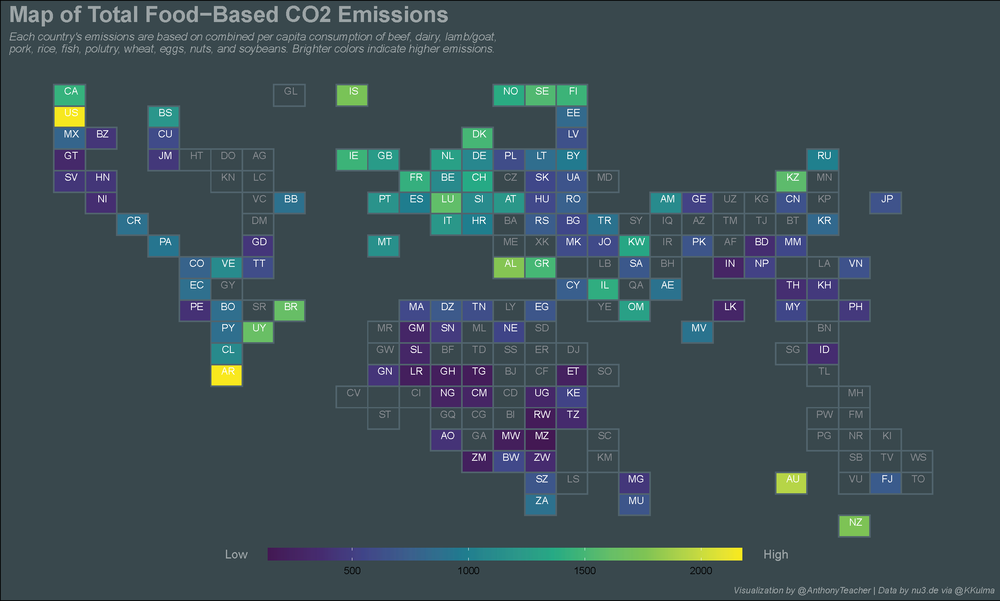

After a long hiatus, I decided to participate in this week's #TidyTuesday on Twitter. The data set was from [nu3.de](https://www.nu3.de/blogs/nutrition/food-carbon-footprint-index-2018) and focused on the 2018 carbon footprint of food based on individual country's consumption of beef, pork, chicken, eggs, nuts, grains, etc. I produced a map of total food-based carbon emissions:



This small project got me thinking about the US, its disproportionate contribution to the climate crisis, and how changing our personal habits may have a positive change.

According to the data, the US is a

```{r}
fit = lm(dist ~ speed, data = cars)
b = coef(summary(fit))
plot(fit)
```

The slope of the regression is `r b[2, 1]`.
