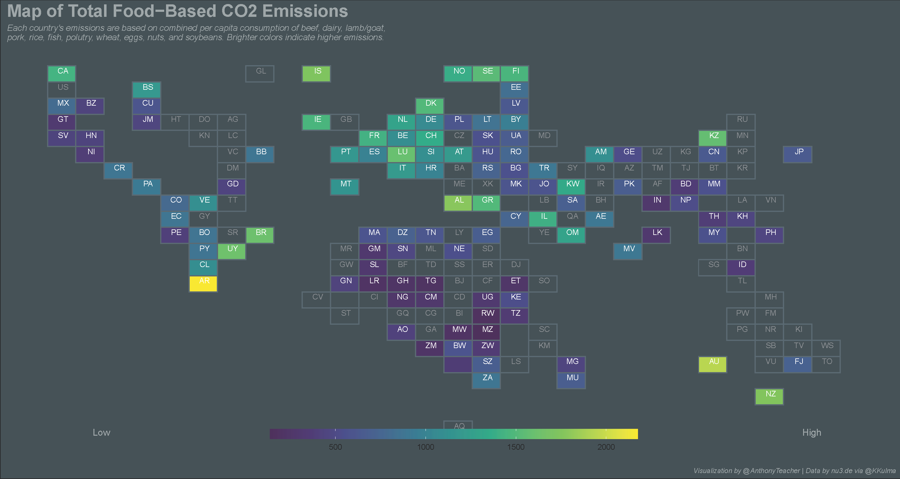
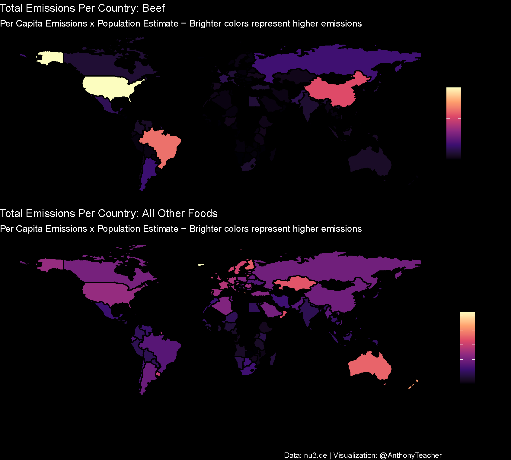

After a long hiatus, I decided to participate in this week's #TidyTuesday on Twitter. The data set was from [nu3.de](https://www.nu3.de/blogs/nutrition/food-carbon-footprint-index-2018) and focused on the 2018 carbon footprint of food based on individual country's consumption of beef, pork, chicken, eggs, nuts, grains, etc. I produced a map of total food-based carbon emissions:

[](tilemap.png)

This small project got me thinking about the United States, its disproportionate contribution to the climate crisis, and how changing our personal habits may have a positive change.

According to the data set, the US is 6th out of over 130 countries in terms of its food-based carbon footprint, and among the different food groups, the largest emissions are due to the consumption of beef.

```{r data, echo=FALSE, message=FALSE, warning=FALSE}
library(tidyverse)
library(ggplot2)
library(gghighlight)
data <- read.csv("food emissions.csv")

top_10 <- data %>% group_by(country) %>% summarize(sum = sum(co2_emmission)) %>% top_n(10, sum) %>% arrange(desc(sum))

data %>% filter(country %in% top_10$country) %>% mutate(
  colored = ifelse(food_category == "Beef", "yes", "no")
) %>% 
  ggplot()+
  coord_flip()+
   geom_bar(aes(x=reorder(country, co2_emmission), y=co2_emmission, fill=colored), stat="identity") +
  scale_fill_manual(values = c( "yes"="#99212d", "no"="grey80" ), guide = FALSE )+
  ggtitle("Top 10 Nations With Highest Per Capita Emissions: Focus on Beef")+
  labs(caption="Data: nu3.de | Visualization: @AnthonyTeacher")+
  ylab("Total Food-Based Emissions in CO2/kg/person")+
  theme(axis.title.y = element_blank(),
        panel.background = element_blank())
```

Why is beef such a carbon-intensive food? Beef requires more land - land for raising cows and  land required to grow the grain to feed them - and more resources overall. According to an article from the [*Smithsonian*](https://www.smithsonianmag.com/science-nature/beef-uses-ten-times-more-resources-poultry-dairy-eggs-pork-180952103/), "beef requires 28 times more land, six times more fertilizer and 11 times more water compared to those other food sources. That adds up to about five times more greenhouse gas emissions." In addition, the [methane released from cows](https://www.npr.org/sections/thesalt/2014/04/11/301794415/gassy-cows-are-warming-the-planet-and-theyre-here-to-stay) increase the already high carbon footprint.

This had me wondering: if beef has such a large carbon footprint, what impact would a reduction in beef consumption have? It also led to a deeper question: can individual changes really help mitigate climate change?

## Eat Less Beef?

The data above indicates Americans eat 36.24kg of beef per person per year, which equates to 1118.29 kg/CO~2~ per person per year. Of course, this is just the average. Some eat more, some eat less or none at all. According to the [US Census Population Clock](https://www.census.gov/popclock/), there were 329,302,971 people in the US on February 19, 2020. Let's trim 5% off of that figure to account for the extremely young and old, and another 4% to account for [the number of vegetarians and vegans in the us](https://en.wikipedia.org/wiki/Vegetarianism_by_country). That leaves
 an estimated beef-consuming US population of 299,665,704 people. Using the emissions figure above, the beef-related emissions of these people equals 335,113,160,126 kg/CO~2~/year, or, **335,113,160 metric tons of CO~2~ each year**. According to the [Global Carbon Project](http://folk.uio.no/roberan/img/GCB2019/PNG/s15_2019_Top_FF_emitters_abs.png), the US emitted 5,400,000,000 metric tons of CO~2~ in 2018. This means that beef emissions account for 6.2% of total US emissions.
 
Is 6% of our carbon footprint a big deal? Well, consider that this is just 6% of emissions based solely on **one** food that we eat. In that case, it is quite a bit! So, if we did reduce our beef consumption, what kind of effect would it have?

The following chart shows the amount of emissions if we reduce our consumption of beef by 10%, 20%, all the way to 100%. It shows a 10% reduction has a carbon footprint of 5.8%. A 50% reduction of beef consumption equates to our habits contributing only 3.1% of the US carbon footprint. This small percentage is **not negligible** when you consider that we need to reduce our emissions by [45% overall](https://www.ipcc.ch/2018/10/08/summary-for-policymakers-of-ipcc-special-report-on-global-warming-of-1-5c-approved-by-governments/).

```{r reduction, echo=FALSE}

data.frame(pct = seq(0, 100, by=10),
                         consumption = rep(36.24, 11),
                         emissions = rep(1118.29, 11),
                         pop = rep(299665704, 11)) %>%
  mutate(total_emissions = pop*emissions,
         reduction = (pop*emissions)-((pop*emissions)*(pct/100)), 
         pct_of_emissions = (reduction/1000)/5400000000) %>%
  ggplot()+
  geom_bar(aes(x=as.factor(pct), y=reduction), fill="#99212d", stat="identity")+
  geom_text(aes(x=as.factor(pct), y=reduction, label=paste0(round(pct_of_emissions*100, digits=1), "%")), vjust=-1)+
  scale_y_continuous(limits=c(0,400000000000), labels=scales::comma_format())+
  ylab("total metric tons \nCO2 / per year")+
  xlab("Percent Reduction of Beef Consumption")+
  ggtitle("The Contributions to US Carbon Emissions \nfrom Associated Reductions in Beef")+
  labs(caption="Data: nu3.de | Visualization: @AnthonyTeacher")+
   theme(axis.title.y = element_text(angle = 0, vjust=.5),
         panel.background = element_blank())
  
```

## Whose Responsibility?

The above indicates that a small change in our eating habits *may* make *some* impact on the planet. These hedges are hard not to notice: *May* and *some*. These reduced impacts assume 1) that everyone will do it, and 2) that individual changes are the root cause of and therefore the solution to the climate crisis.

The EPA says that about 24% of US emissions stem from agriculture (a 50% reduction in beef consumption could reduce that to less than 21%).

But, near equal amounts of emissions come from industry and electricity. Within electricity generation, almost 70% is from industry, transportation, or agriculture. In other words, these emissions are not necessarily caused by individual habits.


In a sense, most emissions are not caused by individuals. Rather, these emissions are generated by government and business. This begs the question of whether it is fair or practical to ask individuals to alter their lifestyle to avert the climate crisis.

Here, we seem to run into an argument that requires mathematical and moral reasoning.

### Mathematical Reasoning

Recall that if we reduce our beef consumption by 50%, we also reduce our emissions from 6.2% to 3.1%. Recall, also, that this is from one* single food source*. Reducing other meat products will lead to other emissions reductions and [a shift to a plant-based diet can reduce emissions by 70%](https://www.accuweather.com/en/weather-news/how-plant-based-diets-can-help-reduce-greenhouse-gas-emissions-by-70-percent/351781).

Asking everyone to be a vegetarian is a radical concept. Asking people to *reduce* (when financially or physically possible) their meat consumption is not. This small change adds certainly has a positive effect and gets us closer to the target of reducing our emissions by 45% by 2030 to stave off warming over 2 degrees.

We can make other changes in our energy consumption and travelling habits, too. But, wait, is it fair to ask the average American to "give up" hamburgers, shell out extra money on energy efficient appliances, and stop flying around the world (flying only contributes about 4.5% to anthropogenic climate change)? 

How is this fair when its government and business driving the climate crisis? Also, how is it fair to ask people to make this kind of sacrifice when they know that the people around them will not? Also, how is it fair to ask people to stop doing these ordinary things that have suddenly become dirty and the cause for climate shame?

### Moral Reasoning

*For this section, I am drawing heavily on [Peeters et al. (2018)](https://link.springer.com/article/10.1007/s10677-019-09995-5).*

Yes, as individuals, our contributions are minuscule. However, they are **real**. One issue is that our individual actions do not directly translate into visible harm and are thought of as future effects and thus easier to disassociate from. However, the climate crisis is not an event in the future, it is already happening: glaciers are melting faster, there are increases in wildfires, storms are intensifying, and low-lying island land is receding. Therefore, our continued contribution as individuals accumulates and exacerbates these issues.

However, even if we make a person change, others may not. This is an inherent dilemma when a problem is caused collectively. The idea is that "No one needs to change until after everyone else changes" (Shue, 1996, p. 112-13). The responsibly gets passed to other people and the solution is undermined by this inaction. The fact is, other people may not change. However, because the climate crisis is both individual- and collectively caused, others' inaction is no excuse for one's own inaction.

The reasoning above assumes, others will not change. However, this is not always the case. One's own individual changes may be mathematically small but can be symbolically profound. That is, our actions serve a symbolic role and can definitely influence others. For example, research has found a clear "neighbor effect" for solar panels, finding that installation of solar panels influences others to do so ([Kosugi et. al, 2019](https://link.springer.com/article/10.1007/s10018-019-00239-5); [Frank, 2020](https://www.theatlantic.com/magazine/archive/2020/03/climate-change-peer-pressure/605515/))

To that end, raising awareness and advocating for change (at school, at work, among family and friends) is another action that can be taken in addition to personal changes.

Unfortunately, we still have several other issues to deal with. One is why is it fair to ask people to stop doing the ordinary things they have always done just because these things have suddenly become associated with the climate crisis. First, as Peeters et al. (2018) point out, "The mere fact that many other people engage in an act does not render it harmless" (p. 433). In addition, what we consider ordinary or usual is certainly not so. Take our beef consumption habits. We are sixth in terms of per capita emissions - sixth out of 130 countries. The beef emissions of the United States equate to the same emissions, per capita, as the bottom 17 countries on beef consumption combined.

```{r bottom_countries, echo=FALSE}
data %>% filter(food_category == "Beef") %>% 
  arrange(co2_emmission) %>%
  mutate(cumsum = cumsum(co2_emmission)) %>%
  filter(cumsum < 1120 | co2_emmission == 1118.29) %>%
  mutate(
    x = ifelse(country=="United States", "USA", "Other Countries")
    ) %>%
  ggplot()+
  geom_bar(aes(x=x, y=co2_emmission, fill=country), stat="identity", position = "stack")+
  ggrepel::geom_label_repel(aes(x=x, y=co2_emmission, label=country, group=country), position = position_stack())+
  scale_fill_viridis_d(option="inferno", begin =0, direction = -1)+
  ggtitle(label="American Beef Consumption Has a Larger Footprint\nthan 17 Other Countries Combined")+
    labs(caption="Data: nu3.de | Visualization: @AnthonyTeacher")+
  theme(legend.position = "none",
        axis.title = element_blank(),
        panel.background = element_blank())
```

Our habits - eating beef, jet-setting around the world, hot showers several times a day, joyriding, leaving the lights on - are certainly normal to us, but around the world, they are matter of factly not the norm. The western world contains around 15% of the world's population, yet has dissproportionatley contributed to the climate crisis through habits it considers ordinary but are in fact unique. These three charts illustrate this:




As Peeters et al. (2018) point out, our actions are ordinary in our local contexts, but unusual in a global context. Since the climate crisis is a global crisis, it is imperative to consider this global context.

The irony here is that the western world is driving climate change, but the effects will be mostly felt by those whose carbon footprints are dwarfed by our own - countries mainly in the global south.

As George Bush Sr. once [declared](http://www.ipsnews.net/2012/05/us-lifestyle-is-not-up-for-negotiation/) at the 1992 Earth Summit in Rio de Janeiro, "The American way of life is not up for negotiations. Period."

Well, if the American way of life is both unusual in the global context and unfairly contributing to the climate crisis, there is a moral imperative that it should be up for "negotiation." And that negotiation does not really mean any radical individual changes: for those who are financially able, it means a reduction in meat consumption, conservation of energy, carefully considering air travel, and, again when financially feasible, investing in renewable energy.

A final idea to deal with is the fact that government and business contribute much more to climate change than individuals. How can our personal changes make any effect when industry emits so much, and government is not investing enough in renewables? 

Well, we vote. Choose local, state, and national politicians who have a genuine concern about the crisis. Next, we vote...with out wallets. As consumers, we drive supply and demand. If we can shift our consumer habits - purchasing less beef, purchasing fuel-efficient or EV vehicles, buying renewable energy power blocks from our utilities, taking less flights - we can have a positive effect on industry. They may produce all the fossil fuels, but we burn them ([Del Valle, 2018](https://www.vox.com/the-goods/2018/10/12/17967738/climate-change-consumer-choices-green-renewable-energy)).

## Conclusion

Individual changes can have both practical and symbolic effects. We can make an impact on our national and global carbon footprints while influencing others to do the same. We can advocate for change in government and be conscious consumers. Climate change is a complex problem, and requires solutions from every angle. As individuals, we can make a difference.

I'll leave the last words to Jamieson (2006, cited in Peeters et. al):

>We must begin from where we are – changing ourselves, changing our leaders, and changing our institutions – but from here we can change the world. Biking instead of driving or choosing the veggieburger rather than the hamburger may seem like small choices, and it may seem that such small choices by such little people barely matter. But ironically, they may be the only thing that matters. For large changes are caused and constituted by small choices. And in the end, however things turn out, it is how we live that gives meaning and significance to our lives.


