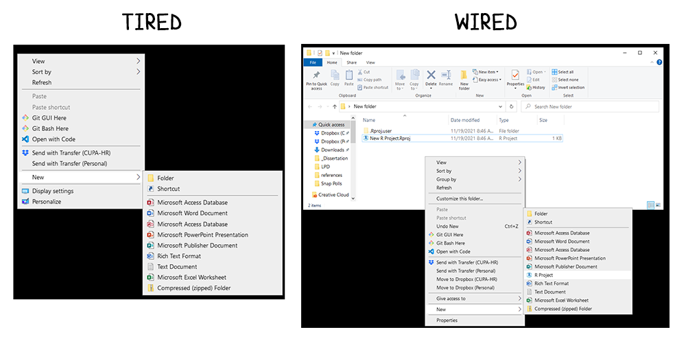
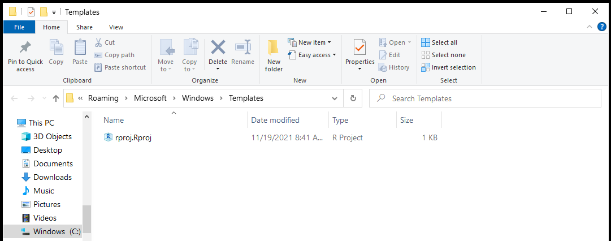

Here is something I have wanted to do for a while: create a new folder and then simply be able to right-click and create a new R Project immediately in that folder. No need to open RStudio and click through the R Project menus. Fast, efficient, and easy.

I finally sat down to do it and here is the result:

Creating it was surprisingly easy and just took a little trial and error. I also followed the advice from [this StackExchange superuser post](https://superuser.com/questions/735582/context-menu-for-new-file-with-template). Here are the steps I followed:

*Note: these steps only apply to the Windows operating system.*

### Create a .Rproj Template

To make this work successfully, windows needs to create an .Rproj file with some attributes filled in. I basically took an existing .Rproj file, copied it to a new folder, and renamed it rproj.Rproj. Alternatively, you could create a blank .txt file, enter in the required contents, and rename it with the .Rproj extension. The contents of the template file were as follows, all of which can be changed to suit your needs and can also be changed later under RStudio -\> Tools -\> Project Options.

    Version: 1.0

    RestoreWorkspace: Yes
    SaveWorkspace: Yes
    AlwaysSaveHistory: Default

    EnableCodeIndexing: Yes
    UseSpacesForTab: Yes
    NumSpacesForTab: 2
    Encoding: UTF-8

    RnwWeave: knitr
    LaTeX: pdfLaTeX

    AutoAppendNewline: Yes
    StripTrailingWhitespace: Yes

    BuildType: Website

This template then needs to placed within a specific folder on your machine. I clicked the Windows key to bring up the start menu and then pasted the following: `%APPDATA%\Microsoft\Windows\Templates` . This brought me to an empty folder, in which I pasted my template file:

### Access the Registry Editor

You now need to set up the context menu. Press the Windows key and type `regedit`. This will give you access to the Registry Editor.

You will need to navigate to `HKEY_CLASSES_ROOT` and look for the `.Rproj` folder. Right click on the folder and select New -\> Key. Call the key `ShellNew` (note the capital letters).

Click on `ShellNew` and within the folder, right click and select New -\> String Value. Call this `FileName` (note the capital letters). After creating `FileName`, right click on it and select Modify. Enter in the name of your .Rproj template (e.g., rproj.Rproj).

This should immediately add it to your context menu under "New".

### Testing

To test this out, create a new folder somewhere on your computer. Right click and select New -\> R Project. Open the R Project. It should work without any issues. To triple-check it is correct, type `getwd()` in the console and make sure it is pointed to the correct directory.

### Notes

1.  The R Project will be named based on the folder that it is in.
2.  I am not responsible for any issues or problems playing with registry keys may cause to your machine.
