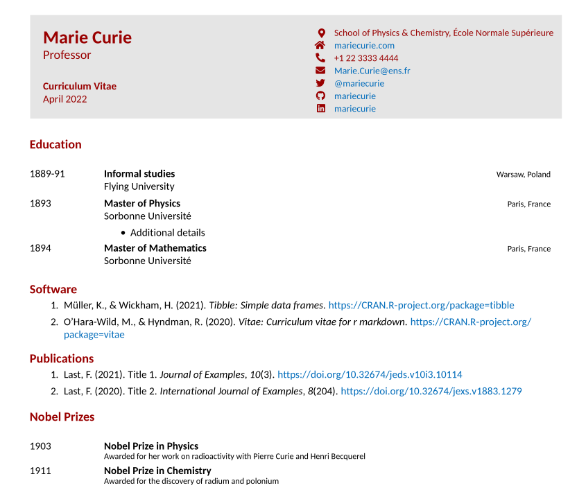
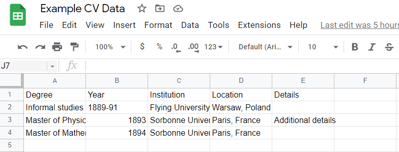
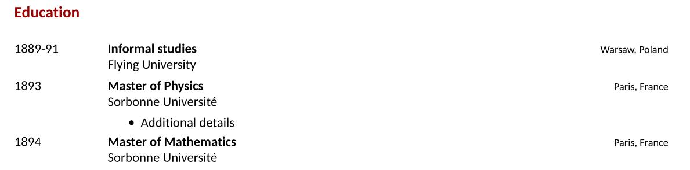
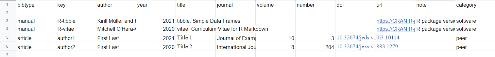
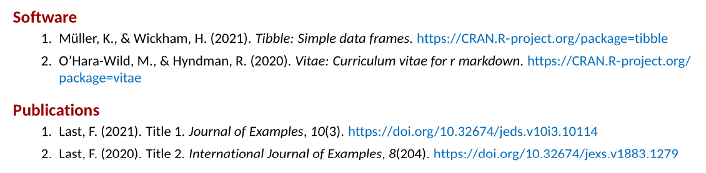
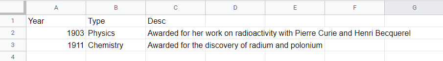
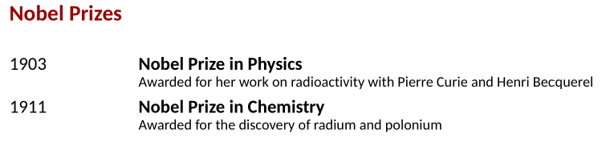

The [`vitae`](https://github.com/mitchelloharawild/vitae) package makes it easy to create a reproducible and dare I say quite sexy looking CV or résumé using R Markdown. Essentially, the Vitae package takes in the key CV data - education, work experience, etc. - as data frames and translates this into a pre-templated LaTeX document which then outputs as a PDF. 

A *very basic* example looks like this:



Many of the `vitae` pre-made examples are based on either creating the data frames in the doc - for example through `tibble::tribble` - or importing via CSV/Excel. Publications can be read in via Google Scholar or a bibliography file. The idea is to update those files, then open up your .Rmd and hit knit.

All of this can also be accomplished via a single Google Sheet where education, work, conferences, publications, etc. can be easily stored and updated. This is how I maintain my CV - almost effortlessly.

I will walk you through how to build a super simple CV using `vitae`, `tidyverse`, and the `googlesheets4` package (or, if you'd prefer something simpler, you can also use the `gsheet` package).

To begin building a CV using `vitae`, you create a new R Markdown document and select a `vitae` template in R Studio. This pre-builds an Rmd file that gives examples of including data via hard-coded data frames or .bib files. Instead, we are going to start from scratch and build a CV using the Hyndman template. Once you see my examples below, they can be extended to any other template you wish.

## Basic Set-up

Starting with a fresh .Rmd file, you begin with the necessary YAML, which can be changed to suit your needs:

```
---
name: Marie
surname: Curie
position: "Professor"
address: "School of Physics & Chemistry, École Normale Supérieure"
phone: +1 22 3333 4444
www: mariecurie.com
email: "Marie.Curie@ens.fr"
twitter: mariecurie
github: mariecurie
linkedin: mariecurie
date: "`r format(Sys.time(), '%B %Y')`"
output: 
  vitae::hyndman
---

```

Next, we will include the chunk that sets some global R Markdown options and loads our key libraries:


````
```{r setup, include=FALSE}
knitr::opts_chunk$set(echo = FALSE, warning = FALSE, message = FALSE)
library(vitae)
library(tidyverse)
library(googlesheets4)
```
````
## Google Sheets

Create a new Google Sheet or make a copy of [this one](https://docs.google.com/spreadsheets/d/1YKFymOOFCN6Ywlbkst3sDkrWDcRRgS6iI2djq_D_0-8/edit#gid=0), which is used in the examples. You can use any number of worksheets and organize it however you want. 

### `googlesheets4` vs `gsheet` Packages

In my examples below, I used the `googlesheets4` package. This requires some beforehand set-up so to authorize the package to interact with your Google Drive account. You can read more about that package [here](https://googlesheets4.tidyverse.org/). If you do not want to mess with authentication, you can use the `gsheet` package, which will allow you to work with any Google Sheet so long as it is viewable by anyone with the link. Just replace `googlesheets4::read_sheet()` with `gsheet::gsheet2tbl()`!

## Education

The first worksheet in my [Example CV Google Sheet](https://docs.google.com/spreadsheets/d/1YKFymOOFCN6Ywlbkst3sDkrWDcRRgS6iI2djq_D_0-8/edit#gid=0) is the education sheet, which is typically the first section of the CV. 



We can read it in to R with `googlesheets4::read_sheet()`. We will then pass it to `vitae::detailed_entries()` and point that function's arguments to the proper columns. The *what, when, where, with,* and *why* arguments refer to the type of information, which is then used with the `vitae` templates to create the proper format.

````
```{r education}
googlesheets4::read_sheet("https://docs.google.com/spreadsheets/d/1YKFymOOFCN6Ywlbkst3sDkrWDcRRgS6iI2djq_D_0-8/edit#gid=0", sheet="Education") %>%
  vitae::detailed_entries(what = Degree,
                          when = Year,
                          where = Institution, 
                          with = Location, 
                          why = Details)
```
````

With the Hyndman template, this becomes this:




## Publications

There are many ways to include publications in your CV. This can be through a bibliography file that you keep, your Google Scholar profile (with the `scholar` package), or in the Google Sheet. I prefer to keep everything in a Google Sheet, so for the example CV, I have a worksheet labeled "Publications" that looks like this:



These are common field names for creating a bibliography file. You can read more about Bibtex field names and their requirements [here](https://www.andy-roberts.net/res/writing/latex/bibentries.pdf). You can build a bibligraphy of not only journal articles but software, conferences, tech reports, and more. The "category" field on the end is so I can separate my publications into categories. For example, if I want to display my software separate from my peer-reviewed journal articles, I just need to use a `filter` after reading in my sheet. I then use the `RefManageR` package to convert the table into a bibliography and write that to a local file. Next, `bibliography_entries` reads in that local bibliography file and renders the correct formatting. The code looks like this:

````
# Software

```{r software}
googlesheets4::read_sheet("https://docs.google.com/spreadsheets/d/1YKFymOOFCN6Ywlbkst3sDkrWDcRRgS6iI2djq_D_0-8/edit#gid=0", sheet="Publications") %>%
  filter(category == "software") %>%
  select(-category) %>%
  RefManageR::as.BibEntry() %>%
  RefManageR::WriteBib("software.bib", biblatex=T)


vitae::bibliography_entries("software.bib") %>%
  arrange(desc(issued))
```

# Publications
```{r peerreviewed}
googlesheets4::read_sheet("https://docs.google.com/spreadsheets/d/1YKFymOOFCN6Ywlbkst3sDkrWDcRRgS6iI2djq_D_0-8/edit#gid=0", sheet="Publications") %>%
  filter(category == "peer") %>%
  select(-category) %>%
  RefManageR::as.BibEntry() %>%
  RefManageR::WriteBib("peerreviewed.bib", biblatex=T)


vitae::bibliography_entries("peerreviewed.bib") %>%
  arrange(desc(issued))
```
````

And the result looks like this:




## Other Content

Of course, you are not limited to education and publications. You can create any type of data in Google Sheets, read it in, and then include it properly formatted with `vitae::detailed_entries`, `vitae::brief_entries`, or `vitae::bibliography_entries`. Here is one final example using the "Nobel Prizes" sheet.

Data:



Code:

````
# Nobel Prizes

```{r}
googlesheets4::read_sheet("https://docs.google.com/spreadsheets/d/1YKFymOOFCN6Ywlbkst3sDkrWDcRRgS6iI2djq_D_0-8/edit#gid=0", sheet="Nobel Prizes") %>% 
  brief_entries(
    glue::glue("Nobel Prize in {Type}"),
    Year, 
    Desc
  )
```
````

Result:



You can include any number of sections as needed and organize both the CV-generating .Rmd file and the Google Sheet however you would like. You can also include text and LaTex within the .Rmd to add more content and customization. I highly recommend checking out the examples linked on the [`vitae` Github repo](https://github.com/mitchelloharawild/vitae) as well as the package vignettes.

[Here](https://github.com/acircleda/CV/blob/master/Anthony%20Schmidt%20-%20Full%20CV/Anthony-Schmidt-CV.pdf) is the current version of my own CV for an example of what you can do.

## Workflow

The process for creating this CV was outlined above. The process for maintaining this CV is quite simple:

1. Update the Google Sheet
2. Open your .Rmd
3. Knit
4. Enjoy!

How often and how automated you do this is up to you! I hope that my blog post is useful for giving you the basic tools needed in making a reproducible, easy-to-maintain CV (or résumé - or both!) in R.