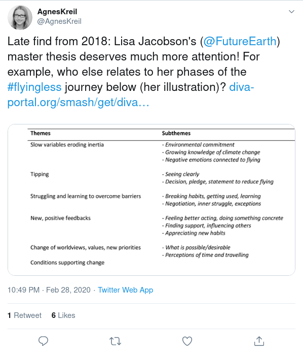

I recently started using [TAGS](https://tags.hawksey.info/) to start archiving Twitter posts with key search phrases for later exploration and possible research. One of my search phrases was the hashtag #flyingless. #flyingless typically is appended to posts related to reducing the carbon footprint associated with flying, often flying to and from conferences, but also flying in general.

By just scraping the past few days worth of data, I found a few interesting takeaways.

# Policies and Guides

Fundings organizations are taking the carbon footprint of their funds into account. This is from the UK, but maybe we will see similar things from NSF or NIH?

The University of Santa Barbara is also promoting smaller carbon footprints with their [Nearly Carbon-Neutral Conference Model Guide](http://hiltner.english.ucsb.edu/index.php/ncnc-guide/)

# Conferences Are Paying Attention

# There is some good research about #flyingless

I learned about [*Flights of fantasy: A reformulation of the flyers’ dilemma*](https://openresearch-repository.anu.edu.au/bitstream/1885/13949/1/Young%20et%20al%20Flights%20of%20Fantasy%202015.pdf) by Young, M., Markham, F., Reis, A. C., & Higham, J. E. (2015).

And this master's thesis by Lisa Jacobson, [*Transforming air travel behavior
in the face of climate change: Incentives and barriers in a Swedish setting*](http://www.diva-portal.org/smash/get/diva2:1221346/FULLTEXT01.pdf)

# People are enjoying #flyingless

People are sharing their #flyingless routes and the joy of slow travel. These mostly seem to be from Europe, where they can take advantage of modern rail travel. 

# TAGS is really cool!

The functionality is really great, as it now only scrapes Twitter from the present to the past 7 days, but you can also ask it to scrape every hour until a maximum amount of Tweets is reached (you set the maximum). It also auto-produces a cool interative dashboard you can play with to explore Twitter users and their tweets in the datset. [*Click here to check out the dashboard related to my #flyingless TAGS.*](https://hawksey.info/tagsexplorer/?key=1CrSy6fhs9x9cadgMLjPJuzfh5C7c5G3_3AMVRiwd1EM&gid=400689247).

If you are wondering what you can do with all this Twitter data, I highly recommend checking out the online book [*Text Mining with R*](https://www.tidytextmining.com/). It's actually incredibly easy and really fun!